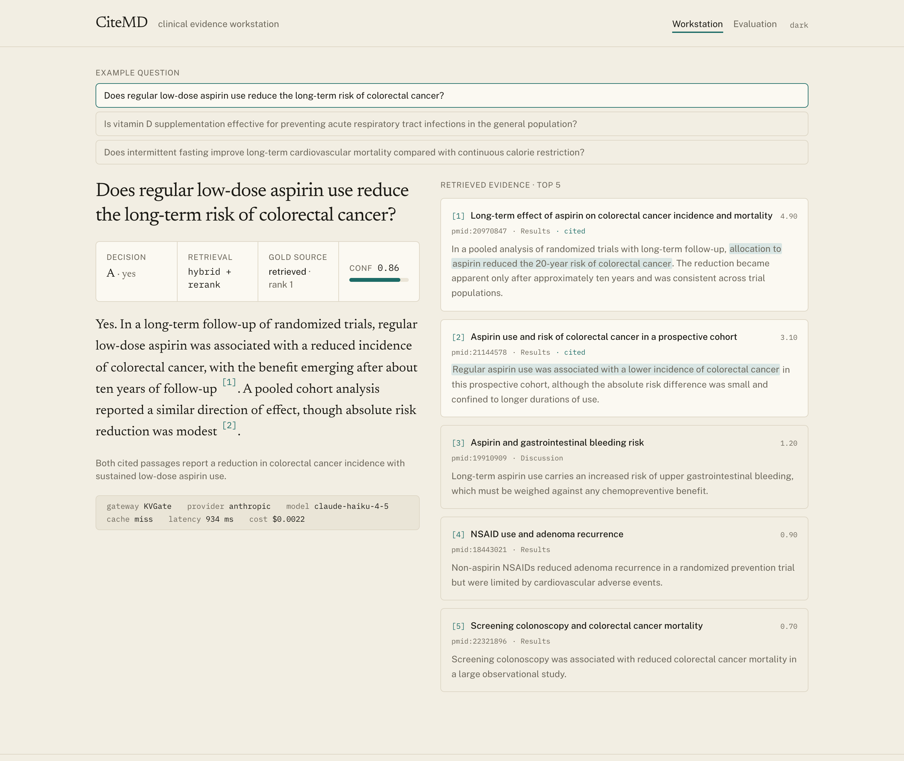
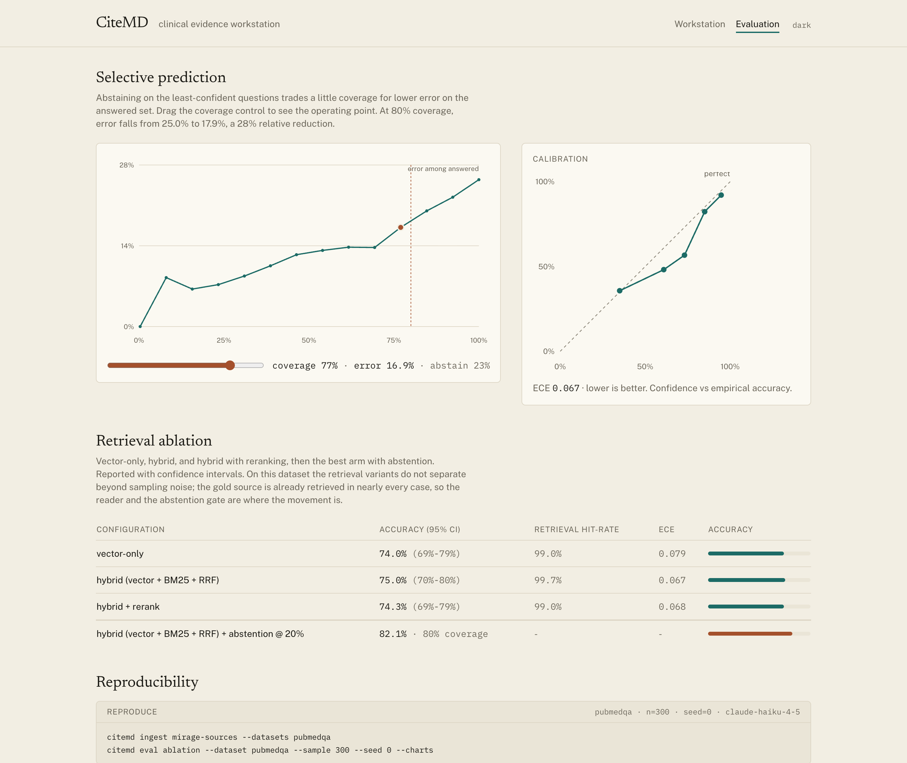
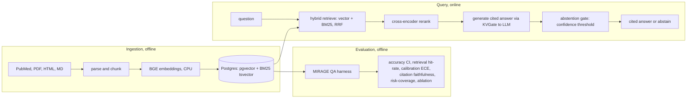
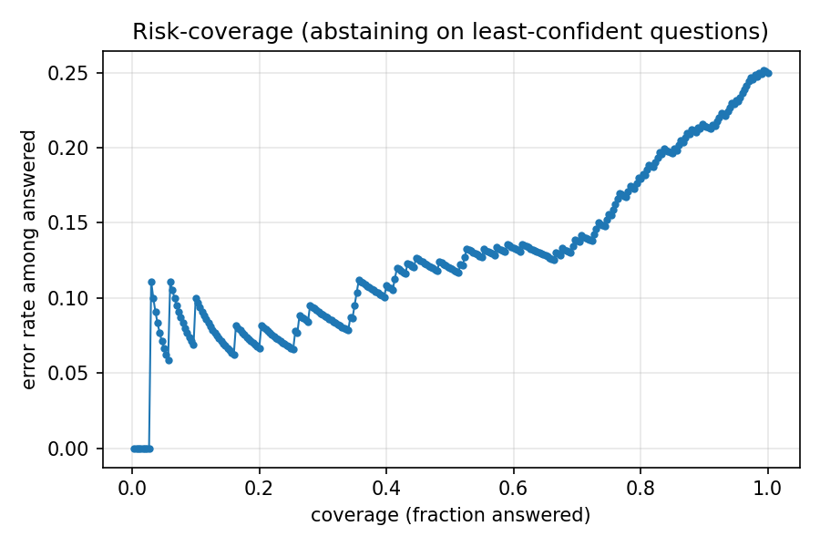
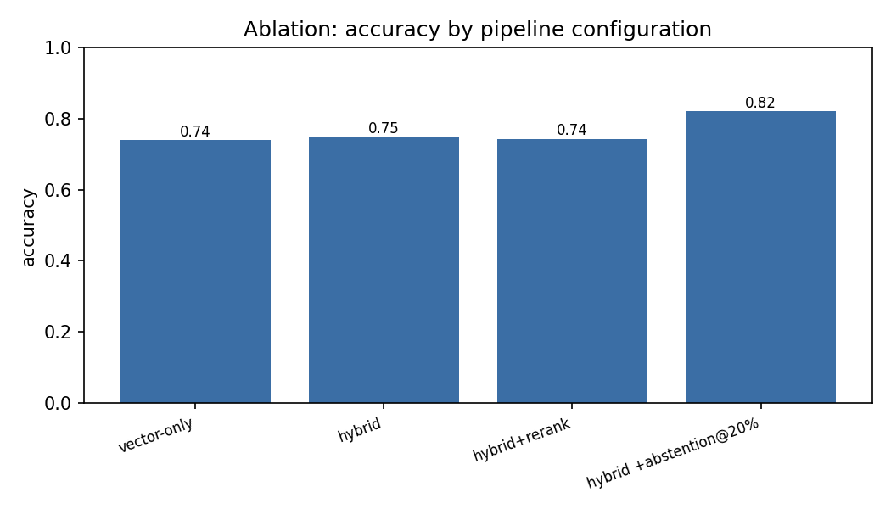

# CiteMD

[](https://github.com/rishika7006/citemd/actions/workflows/ci.yml)
[](LICENSE)

CiteMD is an open-source clinical-evidence RAG that answers medical research questions with
grounded citations and abstains when the retrieved evidence is weak, and it measures that
behavior on the MIRAGE benchmark.

> Research and evaluation only. CiteMD is NOT a clinical tool and must NOT be used for
> diagnosis, treatment, or any patient-care decision. It uses public, non-PHI data only.

## Why this exists

Medicine-specialized language models still hallucinate, and in a clinical setting a confident
wrong answer is worse than no answer. Most retrieval-augmented demos are a chatbot with
citations attached. CiteMD is built around a different question: does the system know when to
stay silent, and can that be measured. The headline is trustworthiness, reported with
confidence intervals and honest negative results, not a happy-path transcript.

Prior art is acknowledged, not ignored. MIRAGE and the MedRAG toolkit
([arXiv:2402.13178](https://arxiv.org/abs/2402.13178)) are the recognized standard for medical
RAG, and CiteMD evaluates on MIRAGE deliberately. This is not a novel algorithm. It is a
rigorously evaluated, reproducible artifact with a sharp trustworthiness and abstention angle.

## What makes it different

- **Calibrated abstention, measured.** The system declines the least-confident questions and
  reports the resulting risk-coverage tradeoff. On PubMedQA, abstaining on the riskiest 20% cut
  the error rate by about 28% relative while still answering 80% of questions, and the
  confidence signal is reasonably calibrated (expected calibration error 0.067).
- **Citation faithfulness, not just citation presence.** An LLM judge checks whether the cited
  passages actually support the answer. On a 60-question sample, 88% of answers had at least one
  cited passage that supports them (with the caveat that the judge is the same model).
- **Honest negative results.** The retrieval ablation shows where techniques did not help. On
  this dataset, BM25 fusion and cross-encoder reranking did not improve accuracy.
- **An evidence workstation, not a chatbot.** The front end shows the cited answer, the
  supporting spans in each source, the abstention decision and confidence, the retrieval mode,
  and the serving path through KVGate.

## App preview

The Evidence Workstation: a cited answer with its supporting spans highlighted in each source, a
decision bar (answer or abstention, confidence, retrieval mode, whether the gold source was
retrieved), and the KVGate serving path.



The Evaluation view: an interactive risk-coverage curve, calibration, and the retrieval ablation
with confidence intervals.



## Architecture



- **Ingestion:** documents are parsed and chunked with source, page, and section metadata,
  embedded on CPU, and stored in a hybrid index (Postgres with pgvector for dense vectors,
  Postgres full-text search for BM25, plus access-control tags).
- **Query:** a question is retrieved against both indexes, fused with Reciprocal Rank Fusion,
  reranked with a cross-encoder, answered with inline citations through the LLM client, then
  passed through a confidence-thresholded abstention gate.
- **Evaluation:** MIRAGE QA sets run through the pipeline to compute accuracy with confidence
  intervals, retrieval hit-rate, calibration, citation faithfulness, and the risk-coverage
  curve, producing the ablation table and charts.

## Evaluation results

MIRAGE / PubMedQA, 300-question seeded sample, `claude-haiku-4-5`. Corpus is about 13,700 PubMed
abstracts: roughly 13.2k topic abstracts as distractors plus the PubMedQA source abstracts
(fetched by PMID) so retrieval has the gold evidence to find. Full write-up and charts:
[results/pubmedqa](results/pubmedqa/README.md).

| Arm | Accuracy (95% CI) | Retrieval hit-rate | ECE |
|-----|-------------------|--------------------|-----|
| vector-only                 | 74.0% (68.8-78.6) | 99.0% | 0.079 |
| hybrid (vector + BM25 + RRF) | 75.0% (69.8-79.6) | 99.7% | 0.067 |
| hybrid + rerank              | 74.3% (69.1-78.9) | 99.0% | 0.068 |
| hybrid + abstention @ 20%    | 82.1% at 80% coverage | - | - |

### Model robustness (Haiku vs Sonnet)

On a matched 100-question sample (same retrieval, only the model changed), a stronger model did
not help. Claude Sonnet 4.6 scored 68.0% (95% CI 58.3 to 76.3) versus Claude Haiku 4.5 at 72.0%
(62.5 to 79.9): indistinguishable on accuracy, and Sonnet was worse calibrated (ECE 0.151 vs
0.063) with a smaller abstention benefit. CiteMD therefore uses Haiku 4.5, which is cheaper,
allows a larger sample, and was better calibrated here. Reproduce with
`CITEMD_LLM_MODEL=claude-sonnet-4-6 citemd eval qa --dataset pubmedqa --sample 100 --seed 0`.

### Risk-coverage and abstention

Abstaining on the least-confident questions trades a little coverage for lower error on the
answered set. On the best arm, error falls from 25.0% to 17.9% (a 28% relative reduction) at 80%
coverage. The risk-coverage curve shows error among answered questions falling smoothly as
coverage drops, which means the confidence signal ranks correct answers above incorrect ones.



### Retrieval ablation, including what did not help

The gold source abstract is retrieved into the top 5 in about 99% of questions, so there is
little room for the retrieval variants to differ. Vector-only, hybrid, and hybrid + rerank land
at 74.0%, 75.0%, and 74.3%, with confidence intervals that overlap almost entirely. The
defensible statement is that these retrieval variants did not improve accuracy on this dataset.
The movement is in the reader and the abstention gate, not in the retriever choice.



## CiteMD plus KVGate

CiteMD is the RAG application. [KVGate](https://github.com/rishika7006/kvgate) is the serving
gateway. Because CiteMD's LLM client speaks the OpenAI protocol, CiteMD can point at KVGate by
changing three environment variables:

```bash
CITEMD_LLM_BASE_URL=http://localhost:8080/v1   # KVGate
CITEMD_LLM_API_KEY=...                          # or "not-needed" for a local gateway
CITEMD_LLM_MODEL=...                            # a logical model defined in KVGate's config
```

This shows how a real RAG system can route generation through a production-style gateway with
response caching, rate limiting, metrics, provider abstraction, and one OpenAI-compatible
endpoint, without changing application code.

What KVGate adds when CiteMD points at a hosted API through it: exact and semantic response
caching (repeated demo questions skip the model, so they are fast and free), token-bucket rate
limiting, per-tenant budgets, failover across providers, a single endpoint, and metrics
including a per-response cache status, latency, and cost that the front end displays.

What it does not add in that mode: GPU KV-cache prefix-aware routing and LMCache offload. With a
hosted API the provider owns the GPU and the KV cache, so those features are not exercised. A
future self-hosted mode (KVGate in front of your own vLLM plus LMCache replicas on a GPU) would
exercise prefix-aware routing and KV offload; KVGate benchmarked those separately. Official
evaluation numbers above were produced by calling Anthropic directly for a stable, reproducible
setup; the gateway path is the demonstration of the composition.

A captured run of CiteMD calling through a running KVGate, showing a response-cache hit turn an
identical request from a real call into a 2 ms cache hit, is in
[docs/kvgate-demo.md](docs/kvgate-demo.md).

### Self-hosted serving benchmark (KVGate + vLLM + LMCache, GPU)

To show what KVGate and LMCache add for self-hosted multimodal serving, CiteMD was run against a
real multimodal clinical workload (48 open-access clinical radiology figures) through KVGate to
two vLLM replicas with LMCache MP mode (CPU L1 + Redis L2), on 2x A40. Full write-up and charts:
[results/modeb](results/modeb/README.md).

- **KVGate prefix-aware routing** cut TTFT p50 by 31% (522 to 362 ms), tail latency p95 by 47%,
  and raised throughput by 54% (1.89 to 2.92 rps), at 99.4% routing affinity.
- **LMCache under GPU memory pressure** (KV capped so it overflows GPU): CPU L1 cut TTFT p50 by
  33% (358 to 239 ms); adding Redis L2 cut tail latency p95 by 65% (1656 to 578 ms) and raised
  throughput by 31%.
- **When the KV fits GPU, LMCache is net overhead** (baseline 102 ms vs L1 127 ms). It is worth
  enabling by the working-set-to-GPU ratio, not by default. Reported honestly, not hidden.

## Web app (Evidence Workstation)

A front end in [`web/`](web/) presents the cited answer, the supporting spans in each source,
the abstention decision and confidence, the retrieval mode, and the KVGate serving metadata,
plus an evaluation view with the interactive risk-coverage curve, calibration, and the ablation.
It runs in demo mode by default (precomputed answers, no key, no model call).

```bash
cd web && npm install && npm run dev   # http://localhost:3000
```

## Install

CiteMD uses a light core so the pure-logic components install and test anywhere with no GPU or
database. Heavier capabilities are optional extras.

```bash
pip install -e ".[dev]"       # test and lint tooling (light core)
pip install -e ".[all]"       # Postgres, embeddings/reranker, parsers, LLM client, charts
```

| Extra    | Adds                                                  |
|----------|-------------------------------------------------------|
| `db`     | `psycopg`, `pgvector` (hybrid index)                  |
| `ml`     | `sentence-transformers`, `numpy` (embeddings/rerank)  |
| `ingest` | `pypdf`, `beautifulsoup4`, `lxml` (parsers)           |
| `llm`    | `openai` (OpenAI-compatible generation client)        |
| `viz`    | `matplotlib` (evaluation charts)                      |
| `all`    | everything above                                      |

## Run locally

```bash
docker compose up -d && citemd db init           # Postgres + pgvector, schema

citemd ingest pubmed --query "type 2 diabetes management" --max 300
citemd query "What is first-line treatment for type 2 diabetes?" --k 5
citemd ask "Does metformin reduce cardiovascular mortality in type 2 diabetes?"

citemd eval fetch                                # MIRAGE datasets
```

Generation needs a backend. Copy `.env.example` to `.env` and set `CITEMD_LLM_BASE_URL`,
`CITEMD_LLM_API_KEY`, and `CITEMD_LLM_MODEL` (Anthropic directly, or KVGate as above).

## Reproduce the results

```bash
# Ingest the PubMedQA source abstracts so retrieval has the gold evidence among distractors
citemd ingest mirage-sources --datasets pubmedqa

# Ablation with confidence intervals, retrieval hit-rate, calibration, and charts
citemd eval ablation --dataset pubmedqa --sample 300 --seed 0 --charts

# Citation faithfulness (LLM-judge support scoring)
citemd eval faithfulness --dataset pubmedqa --sample 60 --seed 0
```

The MIRAGE datasets are class-ordered, so use `--sample` (a seeded random subset), not `--limit`
(the first N in file order), for representative evaluation. Runs cache per question and resume.

## Dataset and safety

- Public, non-PHI data only. No real patient records, no credentialed or PHI datasets.
- MIRAGE (MedQA, PubMedQA, BioASQ, MMLU-Med, MedMCQA) for evaluation; PubMed abstracts for the
  corpus.
- Research and evaluation only. Not for clinical use.

## Limitations

- Results are on one dataset (PubMedQA), n = 300, one generation model. Absolute accuracy will
  shift with a stronger model.
- Because the source abstract is in the corpus, the eval measures reading and abstention given
  retrievable evidence, which is how PubMedQA is meant to be answered, rather than open-web
  retrieval difficulty.
- Confidence is the model's self-reported value; it is reasonably calibrated here (ECE 0.067) but
  is not a guaranteed probability.
- Citation faithfulness uses an LLM judge; a judge at least as strong as the generator is
  preferable, and using the same model to judge its own citations is a known bias.

## Roadmap

- Second dataset (BioASQ) and a stronger-model spot-check.
- Multimodal table and figure retrieval from open-access clinical PDFs.
- A live `/ask` API behind the web app and a self-hosted KVGate serving demo.

## Development

```bash
pip install -e ".[dev]"
ruff check .
pytest
```

The pure-logic core (chunking, RRF, retrieval metrics, selective prediction, calibration, MIRAGE
parsing) is covered by unit tests that need neither a GPU nor a database, so CI stays fast.

## License

[Apache-2.0](LICENSE).
