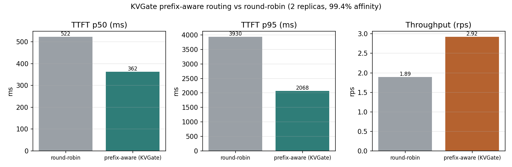
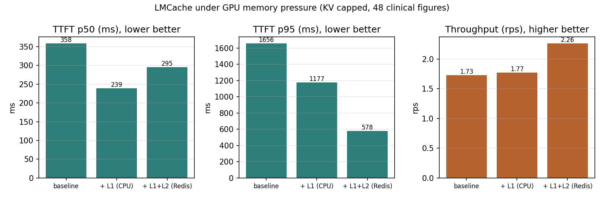
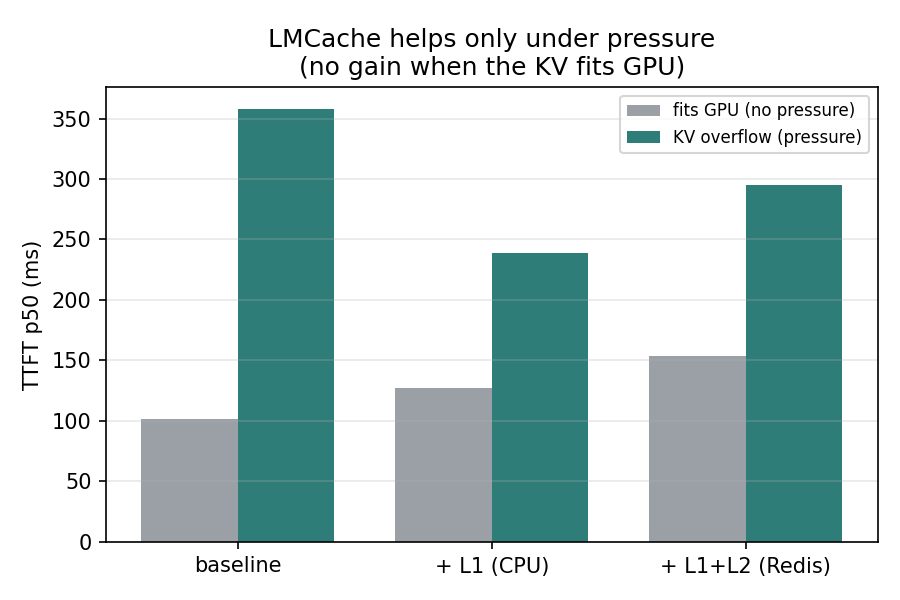

# Mode B: multimodal serving through KVGate and vLLM + LMCache (GPU)

This measures what KVGate and LMCache add when CiteMD serves a real multimodal clinical workload
on self-hosted GPUs, rather than a hosted API. It is a serving-layer benchmark (latency,
throughput, KV cache behavior), not a medical-accuracy benchmark.

## Setup

- Hardware: 2x NVIDIA A40 (46 GB) on RunPod.
- Serving stack: vLLM 0.23.0 and LMCache 0.5.0 in MP mode (a standalone LMCache server, CPU as
  L1 cache and Redis as L2), the same stack proven in the KVGate benchmark.
- Model: `llava-onevision-qwen2-7b` (a vision language model).
- Workload: 48 open-access clinical radiology figures (ROCO, PMC Open Access) with captions,
  driven through the KVGate gateway with repeated and shared figures across sessions.
- Reproduce: `benchmarks/MODE_B_RUNBOOK.md`.

## Result 1: KVGate prefix-aware routing (two replicas)

Two vLLM + LMCache replicas behind KVGate, replaying the same multimodal trace under round-robin
versus KVGate's prefix-aware routing on a fresh flushed fleet.

| Routing | TTFT p50 | TTFT p95 | Throughput | Routing affinity |
|---|---|---|---|---|
| round-robin | 522 ms | 3930 ms | 1.89 rps | - |
| prefix-aware (KVGate) | 362 ms | 2068 ms | 2.92 rps | 99.4% |

Prefix-aware routing cut TTFT p50 by 31%, tail latency (p95) by 47%, and raised throughput by
54%, by sending requests that share a prefix to the replica that already holds its KV warm.

## Result 2: LMCache under GPU memory pressure

Single replica, GPU KV capped (`num-gpu-blocks-override 2560`) so the working set overflows GPU
memory, which is the regime KV offload is built for. Warm requests, mean of two repeats.

| Config | TTFT p50 | TTFT p95 | Throughput | Cache hit |
|---|---|---|---|---|
| baseline (GPU only) | 358 ms | 1656 ms | 1.73 rps | - |
| + LMCache CPU L1 | 239 ms (-33%) | 1177 ms | 1.77 rps | 83% |
| + LMCache CPU L1 + Redis L2 | 295 ms | 578 ms (-65%) | 2.26 rps (+31%) | 100% |

Under pressure, CPU L1 offload cut TTFT p50 by 33% (recovering KV from CPU beats recomputing the
vision prefix), and adding the Redis L2 tier cut tail latency by 65% and raised throughput by
31%. Redis L2 also survives a redeploy that drops the GPU and CPU tiers, so a restarted fleet
serves warm from L2 instead of recomputing.

## Result 3: the honest crossover (no pressure, no gain)

When the working set fits in GPU (default `GPU_UTIL 0.5`, no cap), LMCache is net overhead:
baseline TTFT p50 is 102 ms, while CPU L1 is 127 ms and L1+L2 is 154 ms. vLLM's own in-GPU
prefix cache already serves the KV, so the extra offload path only adds cost.

## What this shows, stated plainly

- KVGate's response cache (hosted mode, no GPU) skips the model entirely on repeated requests.
- KVGate's prefix-aware routing (self-hosted, multiple replicas) cut TTFT and raised throughput
  by routing to the replica with the warm KV.
- LMCache (self-hosted, single or multiple replicas) helps only when the KV overflows GPU
  memory; then CPU L1 cuts TTFT and Redis L2 cuts tail latency and adds capacity and persistence.
  When the KV fits GPU it is overhead. Enable it by the working-set-to-GPU ratio, not by default.
- Prefix-aware routing and LMCache are different mechanisms and are reported separately.
