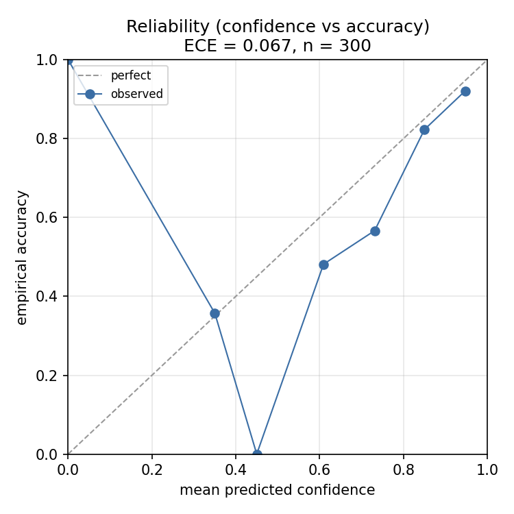

# PubMedQA results

Research and evaluation only; not for clinical use.

## Setup

- **Benchmark:** MIRAGE / PubMedQA, a 300-question representative sample drawn deterministically
  (`--sample 300 --seed 0`). The MIRAGE datasets are class-ordered, so a "first N" slice would
  be a single class; these numbers use a seeded random sample.
- **Generation:** `claude-haiku-4-5` through the OpenAI-compatible client (direct Anthropic
  endpoint for this run; the same client points at KVGate by changing three env vars).
  Temperature 0, answers forced (no prompt-level abstention) so every question yields a
  prediction and a confidence.
- **Corpus:** about 13,700 PubMed abstracts. Roughly 13.2k across 50 clinical topics as
  distractors, plus the 500 PubMedQA source abstracts fetched by PMID, so retrieval has the gold
  evidence to find among distractors. This mirrors MedRAG-style retrieval over a full PubMed
  snapshot at laptop scale.
- **Retrieval:** hybrid (pgvector dense + Postgres BM25, fused with RRF), 30 candidates, top 5
  passages to the model; cross-encoder reranking (`bge-reranker-base`) in the +rerank arm.
- **Scoring:** exact option-key match, the standard MIRAGE/MedRAG setup. Abstention is applied
  offline by declining the least-confident questions (selective prediction). The confidence
  signal is the model's self-reported confidence.

## Ablation (n = 300, 95% confidence intervals)

| Arm | Accuracy | Retrieval hit-rate | ECE |
|-----|----------|--------------------|-----|
| vector-only                  | 74.0% (68.8-78.6) | 99.0% | 0.079 |
| hybrid (vector + BM25 + RRF)  | 75.0% (69.8-79.6) | 99.7% | 0.067 |
| hybrid + rerank               | 74.3% (69.1-78.9) | 99.0% | 0.068 |
| hybrid + abstention @ 20%     | 82.1% at 80% coverage | - | - |

## Headline

On the best retrieval arm, **abstaining on the riskiest 20% of questions cut the error rate from
25.0% to 17.9%, a 28% relative reduction, while still answering 80% of questions.** The
risk-coverage curve shows error among answered questions falling smoothly as coverage drops,
which means the confidence signal ranks correct answers above incorrect ones.

Confidence is reasonably well-calibrated: expected calibration error is 0.067. The reliability
diagram shows the model is somewhat overconfident in the middle of the range and well-calibrated
at high confidence.

## What did not help (reported honestly)

- **Retrieval is not the bottleneck here.** The gold source abstract is retrieved into the top 5
  in about 99% of questions, so there is little room for the retrieval variants to differ.
- **BM25 fusion and cross-encoder reranking did not improve accuracy.** Vector-only, hybrid, and
  hybrid + rerank are 74.0%, 75.0%, and 74.3%, and their confidence intervals overlap almost
  entirely. The defensible statement is that these retrieval variants did not move accuracy on
  this dataset, not that any one is better or worse. The movement is in the reader and the
  abstention gate.

## Caveats

- Single dataset, n = 300, one generation model (`claude-haiku-4-5`). A stronger model may shift
  absolute accuracy. The corpus is a laptop-scale approximation of PubMed, not the full snapshot.
- Because the source abstract is in the corpus, this measures reading and abstention given
  retrievable evidence, closer to how PubMedQA is meant to be answered, rather than open-web
  retrieval difficulty.
- Reproduce with:
  `citemd ingest mirage-sources --datasets pubmedqa` then
  `citemd eval ablation --dataset pubmedqa --sample 300 --seed 0 --charts`.
